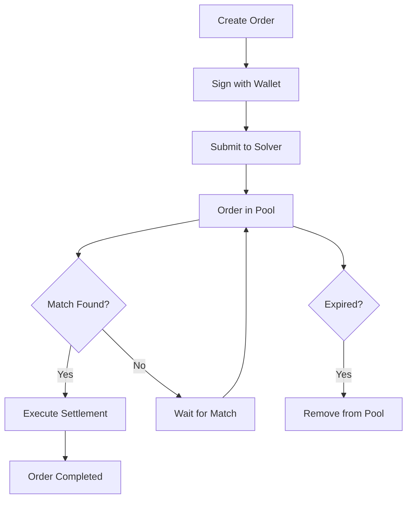

# CoW Protocol Integration Guide

## 🐄 Overview

This guide provides comprehensive instructions for using the CoW Protocol integration with Uniswap V4 hooks. The system combines Uniswap V4's concentrated liquidity with CoW Protocol's gasless trading and MEV protection.

## 📋 Quick Start

### Deployed Contracts

```bash
# CoW Protocol Deployment Addresses
COW_HOOK_ADDRESS=0x42f3D2641c9Ed51aEa542298b2F92D779C9700c0
COW_SOLVER_ADDRESS=0x03837117417572FB2a66137A11A0A0Fcc020D525
POOL_MANAGER_ADDRESS=0xab68573623f90708958c119F7F75236b5F13EF00

# Mock Test Tokens
TEST0_TOKEN=0xe480AaD2C18D9c9979069A50be92f2656D2D857C
TEST1_TOKEN=0x77a0215D490678108270b7a0DF18F33C7fD1a03C
```

### Prerequisites

1. **Wallet Setup**: MetaMask or compatible Web3 wallet
2. **Network**: Ethereum mainnet/testnet (depending on deployment)
3. **Tokens**: TEST0 and TEST1 tokens for testing
4. **Gas**: ETH for transaction fees

## 🚀 Getting Started

### 1. Environment Setup

Create a `.env` file in your project root:

```env
# Blockchain Configuration
PRIVATE_KEY=your_private_key_here
RPC_URL=https://mainnet.infura.io/v3/your_project_id

# CoW Protocol Addresses
COW_HOOK_SALT=0x000000000000000000000000000000000000000000000000000000000000033c
COW_HOOK_ADDRESS=0x42f3D2641c9Ed51aEa542298b2F92D779C9700c0
COW_SOLVER_ADDRESS=0x03837117417572FB2a66137A11A0A0Fcc020D525
POOL_MANAGER_ADDRESS=0xab68573623f90708958c119F7F75236b5F13EF00

# Test Tokens
TEST0_TOKEN=0xe480AaD2C18D9c9979069A50be92f2656D2D857C
TEST1_TOKEN=0x77a0215D490678108270b7a0DF18F33C7fD1a03C
```

### 2. Install Dependencies

```bash
# Install Node.js dependencies
npm install ethers wagmi @tanstack/react-query

# Install CoW Watcher dependencies
npm install dotenv
```

### 3. Start the CoW Watcher

The CoW Watcher automatically matches compatible orders and batches transactions:

```bash
# Make the script executable
chmod +x scripts/cowWatcher.js

# Start the watcher
node scripts/cowWatcher.js
```

Expected output:
```
🚀 Starting CoW Protocol Watcher...
🔍 CoW Protocol Watcher initialized
📜 Solver Contract: 0x03837117417572FB2a66137A11A0A0Fcc020D525
🪝 Hook Contract: 0x42f3D2641c9Ed51aEa542298b2F92D779C9700c0
👤 Watcher Address: 0x...
👀 Starting to watch for CoW events...
🔄 Starting matching loop...
```

## 🏊 Pool Creation

### Step 1: Create CoW-Enabled Pool

1. **Navigate to Pool Creation**:
   - Go to `/create-pool` in your application
   - Connect your wallet

2. **Configure Pool Parameters**:
   ```typescript
   Pool Configuration:
   - Name: "TEST0/TEST1 CoW Pool"
   - Token 0: TEST0 (0xe480AaD...)
   - Token 1: TEST1 (0x77a0215D...)
   - Fee: 0.3% (3000 bps)
   - Initial Price: 1.0 (1:1 ratio)
   - CoW Integration: ✅ Enabled
   ```

3. **Create Pool Transaction**:
   - Review pool preview
   - Click "Create Pool"
   - Confirm transaction in wallet
   - Wait for confirmation

4. **Verify Pool Creation**:
   ```bash
   # Check transaction on Etherscan
   https://etherscan.io/tx/YOUR_TX_HASH

   # Pool will appear in "Your Pools" section
   ```

### Pool Configuration Options

| Parameter | Description | Example |
|-----------|-------------|---------|
| Name | Human-readable pool identifier | "TEST0/TEST1 CoW Pool" |
| Token 0 | First token in the pair (alphabetically lower) | TEST0 |
| Token 1 | Second token in the pair | TEST1 |
| Fee Tier | Trading fee percentage | 0.3% (3000 bps) |
| Initial Price | Starting exchange rate | 1.0 (1:1 ratio) |
| CoW Hook | Enable CoW Protocol integration | ✅ Enabled |

## 📝 Order Management

### Creating Orders

1. **Navigate to CoW Protocol** (`/cow` route):
   ```typescript
   // Order Creation Flow
   1. Select "Create Order" tab
   2. Choose order type (BUY/SELL)
   3. Select token pair (TEST0/TEST1)
   4. Set amounts and deadline
   5. Sign order with wallet
   6. Submit to solver
   ```

2. **Order Parameters**:
   ```typescript
   interface CoWOrder {
     trader: string;        // Your wallet address
     tokenIn: string;       // Token to sell
     tokenOut: string;      // Token to buy
     amountIn: bigint;      // Amount to sell
     amountOutMin: bigint;  // Minimum to receive
     deadline: bigint;      // Order expiry timestamp
     nonce: bigint;         // Unique nonce
     signature: string;     // EIP-712 signature
   }
   ```

### Order Lifecycle



## 🔄 Order Matching Process

### Automatic Matching

The CoW Watcher automatically:

1. **Monitors Events**: Listens for `OrderSubmitted` events
2. **Indexes Orders**: Groups orders by token pairs
3. **Finds Matches**: Identifies compatible buy/sell orders
4. **Validates Compatibility**:
   - Token pairs match (A→B, B→A)
   - Orders haven't expired
   - Amounts satisfy minimum requirements
5. **Executes Settlement**: Calls `matchOrders` on solver

### Manual Matching (UI)

1. **View Pending Orders**: Navigate to "Match Orders" tab
2. **Select Orders**: Choose compatible buy and sell orders
3. **Set Match Amount**: Specify the amount to match
4. **Execute**: Click "Match Orders" to settle

### Matching Criteria

```typescript
// Orders are compatible if:
buyOrder.tokenIn === sellOrder.tokenOut &&
buyOrder.tokenOut === sellOrder.tokenIn &&
buyOrder.deadline >= currentTime &&
sellOrder.deadline >= currentTime &&
buyOrder.amountIn >= matchAmount &&
sellOrder.amountIn >= matchAmount &&
matchAmount >= buyOrder.amountOutMin &&
matchAmount >= sellOrder.amountOutMin
```

## 🛠 Technical Implementation

### Frontend Architecture

```
client/src/
├── components/
│   ├── cow/
│   │   ├── CoWProtocol.tsx       # Main CoW interface
│   │   └── hooks/
│   │       └── useCoWContracts.ts # Contract interactions
│   ├── pool/
│   │   ├── Pool.tsx              # Trading interface
│   │   └── CreatePool.tsx        # Pool creation
├── constants/
│   └── tokens.ts                 # Token configs & addresses
└── pages/
    └── global.css               # CoW-specific styles
```

### Contract Integration

```typescript
// Hook Usage Example
import { useCoWProtocol } from '@/components/cow/hooks/useCoWContracts';

const { submitOrder, matchOrders, userNonce } = useCoWProtocol();

// Create and submit order
const order = {
  trader: address,
  tokenIn: TEST0_TOKEN,
  tokenOut: TEST1_TOKEN,
  amountIn: ethers.parseEther("10"),
  amountOutMin: ethers.parseEther("9.5"),
  deadline: BigInt(Date.now() / 1000 + 3600),
  nonce: userNonce,
};

const signature = await signOrder(order);
await submitOrder(order.tokenIn, order.tokenOut, "10", "9.5", 1);
```

### CoW Watcher Service

```typescript
// Watcher monitors for order events
class CoWWatcher {
  // Track pending orders
  pendingOrders = new Map();
  ordersByToken = new Map();

  // Listen for events
  solverContract.on('OrderSubmitted', (trader, tokenIn, tokenOut, ...) => {
    this.addOrder({ trader, tokenIn, tokenOut, ... });
  });

  // Find and execute matches
  findMatches() {
    // Logic to identify compatible orders
    // Returns array of potential matches
  }

  executeMatch(match) {
    // Call solver.matchOrders with buy/sell orders
  }
}
```

## 🧪 Testing & Development

### Local Testing

1. **Start Development Server**:
   ```bash
   npm run dev
   ```

2. **Connect Test Wallet**:
   - Use MetaMask with test network
   - Import test private key if needed

3. **Get Test Tokens**:
   ```solidity
   // TEST0 and TEST1 are pre-deployed
   // Contact admin for test token distribution
   ```

4. **Create Test Pool**:
   - Use CreatePool interface
   - Enable CoW integration
   - Set 1:1 initial price

5. **Test Order Flow**:
   ```typescript
   // Create opposing orders
   Order 1: Sell 10 TEST0 for ≥9.5 TEST1
   Order 2: Sell 10 TEST1 for ≥9.5 TEST0

   // Orders should automatically match via watcher
   ```

### Debugging

Enable verbose logging:
```bash
# Set environment variable
DEBUG=cow:*

# Or add to watcher script
console.log('Debug:', { order, match, error });
```

Common issues:
- **Signature Mismatch**: Verify EIP-712 domain separator
- **Nonce Issues**: Ensure nonce increments correctly
- **Token Approvals**: Check allowances before matching
- **Expired Orders**: Validate deadline timestamps

## 🔧 Configuration

### Environment Variables

```bash
# Required for deployment
PRIVATE_KEY=0x...           # Deployer private key
RPC_URL=https://...         # RPC endpoint

# Optional configurations
POOL_FEE_DEFAULT=3000       # Default fee tier (0.3%)
ORDER_DEADLINE_DEFAULT=3600 # Default 1 hour
MATCH_CHECK_INTERVAL=5000   # Watcher check interval (ms)
MAX_PENDING_ORDERS=1000     # Memory limit
```

### Frontend Configuration

```typescript
// client/src/constants/tokens.ts
export const CONFIG = {
  defaultFee: FEE_TIERS.MEDIUM,
  defaultPrice: COMMON_PRICE_RATIOS.EQUAL,
  maxOrderHistory: 100,
  refreshInterval: 5000,
};
```

## 📊 Monitoring & Analytics

### Key Metrics

- **Total Orders Created**: Count of submitted orders
- **Successful Matches**: Count of settled orders
- **Average Match Time**: Time from submission to settlement
- **Volume by Token Pair**: Trading volumes
- **MEV Protection**: Gas savings vs. traditional trading

### Event Monitoring

```typescript
// Listen for key events
hookContract.on('CoWOrderMatched', (buyer, seller, tokenIn, tokenOut, amountIn, amountOut) => {
  console.log('✅ Match settled:', {
    buyer, seller,
    tokenIn, tokenOut,
    amountIn: ethers.formatEther(amountIn),
    amountOut: ethers.formatEther(amountOut)
  });
});

solverContract.on('OrderSubmitted', (trader, tokenIn, tokenOut, amountIn, amountOutMin, deadline, nonce) => {
  console.log('📝 New order:', {
    trader,
    pair: `${getTokenSymbol(tokenIn)}/${getTokenSymbol(tokenOut)}`,
    amountIn: ethers.formatEther(amountIn)
  });
});
```

## 🔒 Security Considerations

### Order Validation

```typescript
// Always validate orders before processing
function validateOrder(order: CoWOrder): string[] {
  const errors: string[] = [];

  // Check expiry
  if (order.deadline < Date.now() / 1000) {
    errors.push('Order expired');
  }

  // Verify signature
  const signer = ethers.verifyMessage(orderHash, order.signature);
  if (signer !== order.trader) {
    errors.push('Invalid signature');
  }

  // Check amounts
  if (order.amountIn <= 0 || order.amountOutMin <= 0) {
    errors.push('Invalid amounts');
  }

  return errors;
}
```

### Best Practices

1. **Signature Security**: Never reuse nonces
2. **Amount Validation**: Always check minimum outputs
3. **Deadline Management**: Set reasonable expiry times
4. **Token Approvals**: Use exact amounts when possible
5. **Error Handling**: Gracefully handle failed transactions

## 🐛 Troubleshooting

### Common Issues

**Issue**: Orders not matching automatically
```bash
# Check watcher logs
node scripts/cowWatcher.js

# Verify order compatibility
# Ensure token pairs are opposite (A→B, B→A)
# Check amounts satisfy minimums
```

**Issue**: Pool creation fails
```bash
# Verify contract addresses
echo $POOL_MANAGER_ADDRESS

# Check wallet connection
# Ensure sufficient gas
# Validate token addresses
```

**Issue**: Signature verification fails
```typescript
// Check domain separator
const domainSeparator = await hookContract.DOMAIN_SEPARATOR();

// Verify order hash calculation
const orderHash = keccak256(abi.encode(...orderData));
```

### Support

For technical issues:
1. Check the [GitHub Issues](https://github.com/your-repo/issues)
2. Review contract addresses and deployment
3. Verify environment configuration
4. Test with minimal example orders

## 📚 Additional Resources

### Documentation Links
- [Uniswap V4 Documentation](https://docs.uniswap.org/sdk/v4/overview)
- [CoW Protocol Documentation](https://docs.cow.fi/)
- [EIP-712 Specification](https://eips.ethereum.org/EIPS/eip-712)

### Code Examples
- [Complete Integration Example](./client/src/components/cow/CoWProtocol.tsx)
- [Watcher Implementation](./scripts/cowWatcher.js)
- [Token Configuration](./client/src/constants/tokens.ts)

### Tools
- [Etherscan Contract Verification](https://etherscan.io/)
- [MetaMask Developer Documentation](https://docs.metamask.io/)
- [Wagmi React Hooks](https://wagmi.sh/)

---

## 🎯 Next Steps

1. **Deploy to Production**: Use mainnet contract addresses
2. **Add More Token Pairs**: Expand beyond TEST0/TEST1
3. **Implement Advanced Matching**: Add price improvement algorithms
4. **Build Analytics Dashboard**: Track protocol metrics
5. **Mobile Optimization**: Enhance mobile user experience

For questions or contributions, please refer to the project README or open an issue.

---

**⚠️ Disclaimer**: This is experimental software. Use at your own risk. Always verify transactions before signing.