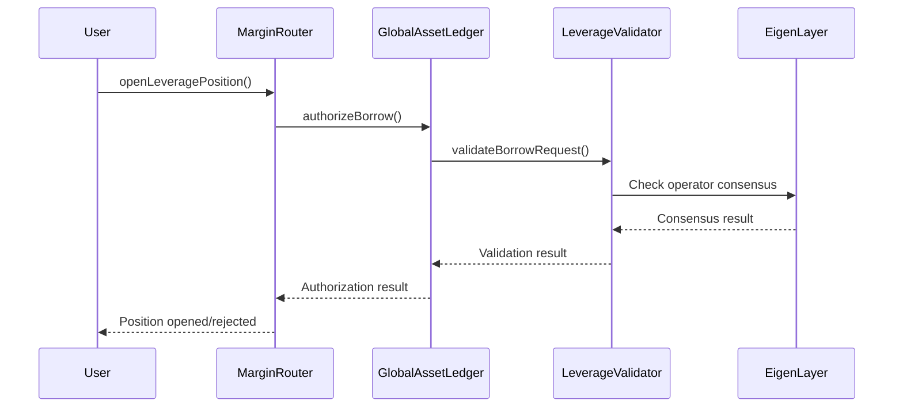

# Shinrai Protocol Deployment Guide

## Overview
This guide walks you through deploying the Shinrai leveraged trading protocol with EigenLayer operator integration.

## Quick Start - How to Deploy

```bash
# Make sure you're in the Shinrai directory
cd /mnt/d/atrium/Shinrai

# Step 1: Deploy Core Contracts
forge script script/01_DeployCore.s.sol:DeployCore --rpc-url https://ethereum-holesky-rpc.publicnode.com --broadcast

# Step 2: Register Operators
forge script script/02_RegisterOperators.s.sol:RegisterOperators --rpc-url https://ethereum-holesky-rpc.publicnode.com --broadcast

# Step 3: Configure Protocol
forge script script/03_ConfigureProtocol.s.sol:ConfigureProtocol --rpc-url https://ethereum-holesky-rpc.publicnode.com --broadcast

# Step 4: Test (Optional)
forge script script/04_TestIntegration.s.sol:TestIntegration --rpc-url https://ethereum-holesky-rpc.publicnode.com --broadcast
```

## Prerequisites

### 1. Environment Setup
- Forge/Foundry installed
- Access to Holesky testnet
- Test ETH for gas fees

### 2. Private Keys Setup
Your private keys are already configured in `.env`:
- **Deployer/Owner**: `0xd14fde811769b2e5b04cb8ce94cd5f53d182f5f5fb4fad5709cea43342ba8377`
- **Operator**: `0xc1681ebfed0c75026d99b14ff636267c84b5a3a6e28530abf299c57cfc13bea5`

## Script-to-Contract Mapping

### `01_DeployCore.s.sol` - Deploys Core Infrastructure
**Deploys:**
- ✅ **PoolManager** (Mock Uniswap V4 manager)
- ✅ **MockLeverageValidator** (EigenLayer validator implementation)
- ✅ **LeverageHook** (Uniswap V4 hook with proper flags)
- ✅ **GlobalAssetLedger** (Central accounting system)
- ✅ **MarginRouter** (User-facing entry point)

**Constructor Arguments:**
- `PoolManager()` - No arguments
- `MockLeverageValidator()` - No arguments
- `LeverageHook(poolManager, leverageValidator)` - Pool manager address, validator address
- `GlobalAssetLedger(leverageValidator, protocolOwner)` - Validator address, owner address
- `MarginRouter(poolManager, leverageValidator, protocolOwner)` - Pool manager, validator, owner

### `02_RegisterOperators.s.sol` - EigenLayer Integration
**Interacts with:**
- ✅ **EigenLayer DelegationManager** (External)
- ✅ **EigenLayer AVSDirectory** (External)
- ✅ **MockLeverageValidator** (Our contract)

**Registration Process:**
1. Register operators with EigenLayer's DelegationManager
2. Create operator signatures for AVS registration
3. Register operators with our LeverageValidator

### `03_ConfigureProtocol.s.sol` - Protocol Setup
**Configures:**
- ✅ **GlobalAssetLedger** - Sets borrow caps and authorizations
- ✅ **MarginRouter** - Sets leverage limits and pool authorizations

**Configuration Parameters:**
- Global borrow caps: 10M tokens per asset
- Pool borrow caps: 1M tokens per pool per asset
- Max global leverage: 10x (1000 basis points)

### `04_TestIntegration.s.sol` - Testing Framework
**Tests:**
- ✅ **All deployed contracts** - End-to-end functionality
- ✅ **Mock token interactions** - Token deployment and minting
- ✅ **Operator validation** - EigenLayer integration testing

## Deployment Workflow

### Phase 1: Core Contract Deployment

```bash
# 1. Deploy core contracts
forge script script/01_DeployCore.s.sol:DeployCore --rpc-url https://ethereum-holesky-rpc.publicnode.com --broadcast

# This deploys:
# - PoolManager (mock)
# - MockLeverageValidator
# - LeverageHook (with proper Uniswap V4 flags)
# - GlobalAssetLedger
# - MarginRouter
```

**Expected Output:**
```
PoolManager deployed at: 0x...
MockLeverageValidator deployed at: 0x...
LeverageHook deployed at: 0x...
GlobalAssetLedger deployed at: 0x...
MarginRouter deployed at: 0x...
```

### Phase 2: Operator Registration

```bash
# 2. Register operators with EigenLayer
forge script script/02_RegisterOperators.s.sol:RegisterOperators --rpc-url $RPC_URL --broadcast

# This performs:
# - Registers operators with EigenLayer DelegationManager
# - Creates operator signatures for AVS registration
# - Registers operators with Shinrai's LeverageValidator
```

**Expected Output:**
```
=== Registering Operator1 ===
✓ Successfully registered with DelegationManager
✓ Signature created
✓ Successfully registered with Leverage AVS

=== Registering Operator2 ===
✓ Already registered with DelegationManager
✓ Signature created
✓ Successfully registered with Leverage AVS
```

### Phase 3: Protocol Configuration

```bash
# 3. Configure protocol parameters
forge script script/03_ConfigureProtocol.s.sol:ConfigureProtocol --rpc-url $RPC_URL --broadcast

# This configures:
# - GlobalAssetLedger authorizations and borrow caps
# - MarginRouter leverage limits and pool authorizations
# - Mock pool setups for testing
```

**Expected Output:**
```
✓ MarginRouter authorized
✓ Global borrow caps set
✓ Max global leverage set to 10x
✓ TOKEN0/TOKEN1 pool configured
✓ WETH/TOKEN0 pool configured
✓ WETH/TOKEN1 pool configured
```

### Phase 4: Integration Testing

```bash
# 4. Test the deployed protocol
forge script script/04_TestIntegration.s.sol:TestIntegration --rpc-url $RPC_URL --broadcast

# This tests:
# - Token deployment and minting
# - Operator validation functions
# - Borrow authorization flow
# - Position management capabilities
# - Emergency functions
```

**Expected Output:**
```
✓ TEST0 deployed and tokens minted
✓ Operator validation tests passed
✓ Borrow authorization: APPROVED
✓ Position management ready
✓ Emergency functions working
✅ All tests passed! Protocol is ready for use.
```

## What Each Component Does

### 1. **LeverageValidator (Mock)**
- **Role**: Simulates EigenLayer operator validation
- **Functions**: Validates leverage positions, borrow requests, swaps
- **Integration**: Operators register here and provide validation consensus

### 2. **LeverageHook**
- **Role**: Uniswap V4 hook for swap/liquidity validation
- **Functions**: Validates swaps before execution, prevents manipulation
- **Integration**: Called automatically by Uniswap V4 PoolManager

### 3. **GlobalAssetLedger**
- **Role**: Central accounting and risk management
- **Functions**: Tracks borrows, caps, collateral, funding rates
- **Integration**: Authorizes all borrow requests through EigenLayer

### 4. **MarginRouter**
- **Role**: User-facing entry point for leverage trading
- **Functions**: Opens/closes positions, manages lifecycle
- **Integration**: Coordinates between all other components

## Operator Validation Flow



## Testing the Protocol

### 1. **Mock Position Opening**
```solidity
// This would be done through a frontend or direct contract call
marginRouter.openLeveragePosition(
    poolKey,           // Uniswap V4 pool
    collateralToken,   // e.g., WETH
    100 ether,         // Collateral amount
    300 ether,         // Borrow amount
    300,               // 3x leverage
    true               // Long position
);
```

### 2. **Operator Validation**
- Operators receive position requests
- Multiple operators validate independently
- Consensus required for approval
- Slashing for incorrect validations

### 3. **Risk Management**
- Global borrow caps: 10M tokens per asset
- Pool borrow caps: 1M tokens per pool per asset
- Max leverage: 10x globally
- Utilization limits: 95% max

## Production Considerations

### 1. **Replace Mock Components**
- Deploy real EigenLayer AVS instead of MockLeverageValidator
- Use actual Uniswap V4 pools instead of mock pools
- Implement real price feeds and oracles

### 2. **Security Enhancements**
- Multi-sig for owner functions
- Timelock for critical parameter changes
- Comprehensive testing with mainnet conditions

### 3. **Operator Requirements**
- Minimum stake requirements
- Slashing conditions and penalties
- Performance monitoring and reputation

## Troubleshooting

### Common Issues:

1. **"Operator already registered"**
   - This is normal for repeat deployments
   - Script handles this gracefully

2. **"Pool not authorized"**
   - Ensure Step 3 (ConfigureProtocol) completed
   - Check pool parameters match exactly

3. **"Insufficient gas"**
   - Increase gas limit in forge commands
   - Ensure sufficient ETH in deployer account

4. **Hook deployment fails**
   - Hook address must match permission flags
   - Using `deployCodeTo` for deterministic addresses

## Next Steps

After successful deployment:

1. **Frontend Integration**: Build UI for position management
2. **Monitoring**: Set up operator monitoring and alerts
3. **Mainnet Preparation**: Security audits and testing
4. **Operator Onboarding**: Recruit and onboard real operators

## Frontend Arguments - What Users Pass to Each Contract

### 1. **MarginRouter** - Main User Interface

#### `openLeveragePosition()`
**Frontend Arguments:**
```javascript
{
  poolKey: {
    currency0: "0x...",      // Token 0 address
    currency1: "0x...",      // Token 1 address
    fee: 3000,               // Pool fee (0.3%)
    tickSpacing: 60,         // Tick spacing
    hooks: "0x..."           // LeverageHook address
  },
  collateralToken: "0x...",  // Token used as collateral
  collateralAmount: "100000000000000000000", // 100 tokens (18 decimals)
  borrowAmount: "300000000000000000000",     // 300 tokens to borrow
  leverageRatio: 300,        // 3x leverage (300 basis points)
  isLongPosition: true       // true = long, false = short
}
```

#### `closeLeveragePosition()`
**Frontend Arguments:**
```javascript
{
  positionId: "0x...",      // Position ID returned from opening
  poolKey: {                // Same pool key as opening
    currency0: "0x...",
    currency1: "0x...",
    fee: 3000,
    tickSpacing: 60,
    hooks: "0x..."
  }
}
```

#### `getTraderPositions()`
**Frontend Arguments:**
```javascript
{
  trader: "0x..."           // User's wallet address
}
```

### 2. **GlobalAssetLedger** - Risk Management Interface

#### `depositCollateral()`
**Frontend Arguments:**
```javascript
{
  token: "0x...",           // Token address (WETH, USDC, etc.)
  amount: "1000000000000000000000" // 1000 tokens (18 decimals)
}
```

#### `withdrawCollateral()`
**Frontend Arguments:**
```javascript
{
  token: "0x...",           // Token address
  amount: "500000000000000000000"  // 500 tokens to withdraw
}
```

### 3. **LeverageHook** - Automatic Validation (No Direct Frontend Calls)
This contract is called automatically by Uniswap V4 during swaps/liquidity operations.

## EigenLayer Operator Arguments - What Operators Provide

### 1. **LeverageValidator** - Operator Validation Functions

#### `validateLeveragePosition()`
**Operator Arguments:**
```javascript
{
  position: {
    trader: "0x...",         // Trader address
    collateralToken: "0x...", // Collateral token
    borrowedToken: "0x...",   // Borrowed token
    collateralAmount: "100000000000000000000",
    borrowedAmount: "300000000000000000000",
    leverageRatio: 300,       // 3x leverage
    isLongPosition: true,
    openTimestamp: 1703001600,
    positionId: "0x..."
  },
  operatorSignatures: [      // BLS signatures from validating operators
    "0x...",                 // Operator 1 signature
    "0x...",                 // Operator 2 signature
    "0x..."                  // Operator 3 signature
  ]
}
```

**Operator Returns:**
```javascript
{
  isValid: true,             // true = approve, false = reject
  reason: "Position within risk parameters" // Explanation
}
```

#### `validateBorrowRequest()`
**Operator Arguments:**
```javascript
{
  marketId: "0x...",         // Pool identifier
  borrower: "0x...",         // Borrower address
  borrowToken: "0x...",      // Token to borrow
  borrowAmount: "300000000000000000000",
  collateralAmount: "100000000000000000000"
}
```

**Operator Returns:**
```javascript
{
  canBorrow: true,           // true = approve, false = reject
  maxBorrowAmount: "300000000000000000000",
  requiredCollateral: "100000000000000000000",
  liquidationThreshold: 8000, // 80% (basis points)
  reason: "Sufficient collateral provided"
}
```

#### `verifySwap()`
**Operator Arguments:**
```javascript
{
  marketId: "0x...",         // Pool identifier
  params: {
    zeroForOne: true,        // Swap direction
    amountSpecified: "-1000000000000000000", // 1 token exact input
    sqrtPriceLimitX96: "0"   // No price limit
  },
  hookData: "0x..."          // Additional hook data
}
```

**Operator Returns:**
```javascript
{
  canSwap: true              // true = allow swap, false = block
}
```

#### `checkLiquidation()`
**Operator Arguments:**
```javascript
{
  positionId: "0x..."        // Position to check
}
```

**Operator Returns:**
```javascript
{
  shouldLiquidate: false,    // true = liquidate, false = healthy
  liquidationPrice: "0",     // Price at which to liquidate
  healthFactor: 1500         // 150% health (1500 basis points)
}
```

### 2. **Cross-Pool Exposure Validation**

#### `checkCrossPoolExposure()`
**Operator Arguments:**
```javascript
{
  trader: "0x...",           // Trader address
  newPosition: {             // New position being opened
    trader: "0x...",
    collateralToken: "0x...",
    borrowedToken: "0x...",
    collateralAmount: "100000000000000000000",
    borrowedAmount: "300000000000000000000",
    leverageRatio: 300,
    isLongPosition: true,
    openTimestamp: 1703001600,
    positionId: "0x..."
  }
}
```

**Operator Returns:**
```javascript
{
  exceedsLimit: false,       // true = reject, false = allow
  currentExposure: "500000000000000000000", // 500 tokens current
  maxAllowedExposure: "1000000000000000000000" // 1000 tokens max
}
```

### 3. **Price Manipulation Detection**

#### `checkPoolManipulation()`
**Operator Arguments:**
```javascript
{
  marketId: "0x...",         // Pool identifier
  priceData: "0x...",        // Encoded price history
  volumeData: "0x..."        // Encoded volume data
}
```

**Operator Returns:**
```javascript
{
  isManipulated: false,      // true = manipulation detected
  priceDeviation: 250,       // 2.5% deviation (basis points)
  volumeAnomaly: 0,          // Volume anomaly score
  liquidityChange: 100,      // 1% liquidity change
  suspiciousOperators: []    // Array of suspicious operator addresses
}
```

## Operator Consensus Process

### 1. **Multi-Operator Validation**
- Minimum 3 operators must validate each request
- 2/3 majority required for approval
- Operators stake ETH that can be slashed for incorrect validations

### 2. **Validation Timeline**
- Position requests: 30 seconds validation window
- Swap validations: 5 seconds validation window
- Liquidation checks: 10 seconds validation window

### 3. **Slashing Conditions**
- Approving manipulative trades: 10% stake slashed
- Incorrect liquidation decisions: 5% stake slashed
- Failing to respond: 1% stake slashed

## Contract Addresses

After deployment, your contract addresses will be saved in `deployed_addresses.txt`:

```
POOL_MANAGER_ADDRESS=0x...
LEVERAGE_VALIDATOR_ADDRESS=0x...
LEVERAGE_HOOK_ADDRESS=0x...
GLOBAL_ASSET_LEDGER_ADDRESS=0x...
MARGIN_ROUTER_ADDRESS=0x...
```

Keep these addresses safe - they're needed for frontend integration and future interactions!

## Support

If you encounter issues:
1. Check the console output for specific error messages
2. Verify all environment variables are set correctly
3. Ensure sufficient test ETH for gas fees
4. Review the transaction hashes on Holesky explorer